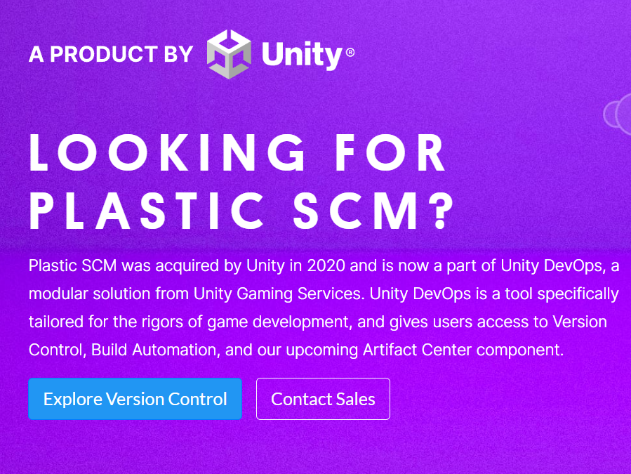
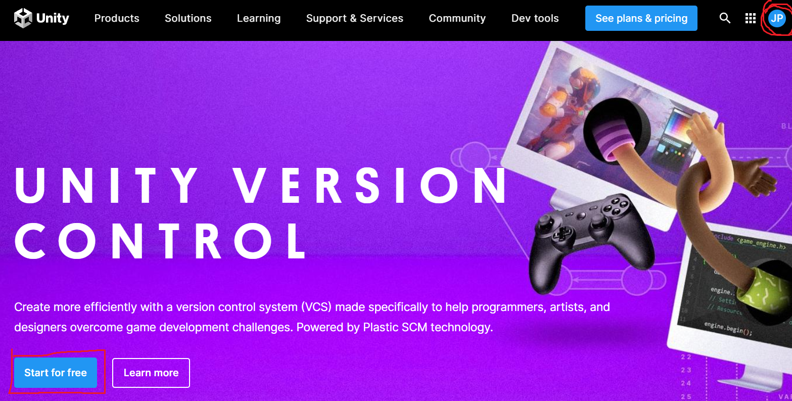
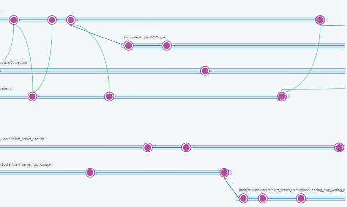

## Plastic SCM
1. plastic SCM 간단 설명
    - Unity Plastic SCM은 버전 관리 및 소스 코드 관리 툴
    - 아티스트와 프로그래머의 워크플로를 최적화하고, 대용량 파일과 바이너리로 작업할 때 속도를 크게 향상시켜 준다.
    - 일반적인 협업 툴로 활용되는 gitlab 혹은 github은 용량 제한이 있기 때문에 대용량 파일 작업이 필요한 Unity 프로젝트에서 사용
2. plastic SCM 다운로드
    - https://www.plasticscm.com/
    - Explore Version Control 선택
    - 
    - 이후 단계에서 Plastic SCM을 사용하기까지는 Unity 계정 필요
        - Unity 계정으로 접속 혹은, Unity 회원 가입 후 이용 가능
        - 

    - Start for Free 선택 이후, 등록 계정 수 및 저장 용량에 따라 부과되는 요금 확인 후 프로젝트 시작
    - 계정 담당자가 사용 계정 수만큼 계정 등록 후 시작
    - 다음과 같이 유저를 추가해주어야 한다.
    - 
3. 사용
    - 직접적인 사용 방법은 대략적으로 github, gitlab 등과 크게 다르지 않지만 merge하는 방식에서 혼동 유의
        - gitlab 커밋 <-> plastic SCM 체인지 세트
        - 
