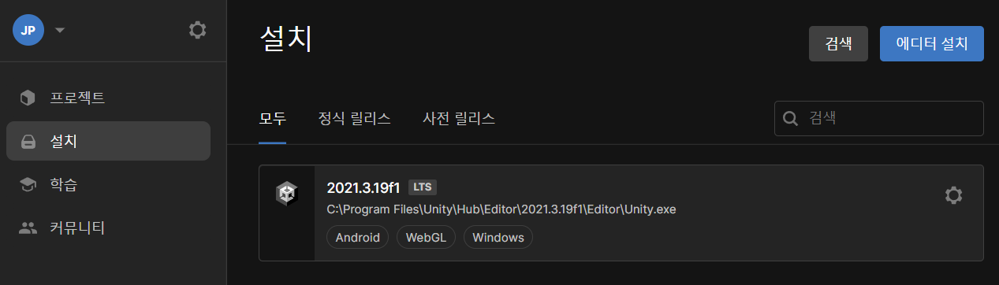
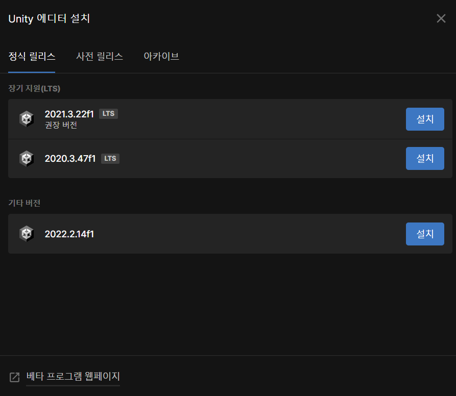

## Unity 환경설정
1. 유니티 설치
    - 유니티 허브 실행 후, 설치 탭 선택
    - 
    - 설치 탭 선택 이후, 에디터 설치 선택
    - 
    - 유니티 에디터 선택
    - 정식 릴리즈에서 LTS 버전 및 출시된 버전, 사전 릴리즈에서 베타 및 알파 버전 확인 가능
    - 유니티 에디터에서 여러 버전 관리도 가능
    - 원하는 버전이 없다면 아카이브 탭 선택 후 아카이브 다운로드 선택하여 원하는 버전 개별 다운로드 가능
    - 
2. 모듈 추가
    - 원하는 모듈 추가
    - 만드는 버전에 빌드 서포터 / 언어팩 등을 모듈로 설치 가능
        - Ex. 윈도우 빌드 서포터 설치 시, 윈도우에서는 빌드 설정 이후 빌드 버튼만 클릭하면 쉬운 빌드 가능
    - 