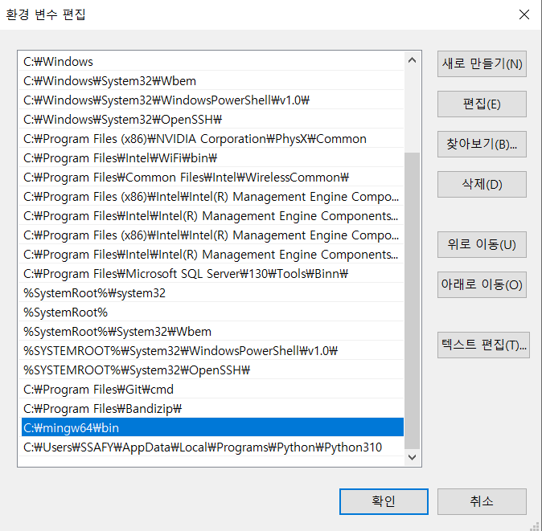

1. 서버 관련 프로그램 다운이 필요
https://drive.google.com/file/d/1NTYl7ToaA-hFYESBkeryod9dEmjTem2f/view

2. 위의 링크에서 파일을 다운 받은 후 원하는 곳에 압축을 해제한다. 

3. 경로를 복사한다.
 

4. 환경변수 설정

5. 컴파일러 버전이 확인이 된다면 세팅이 완료된다.

6. test 응용 프로그램을 사용해서 서버 실행이 가능하다.

