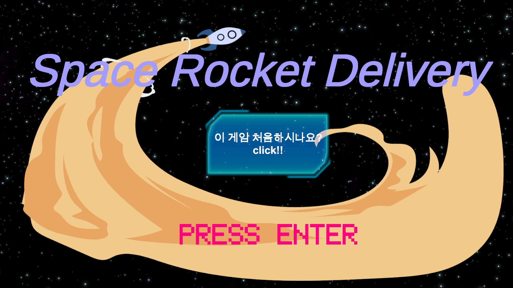
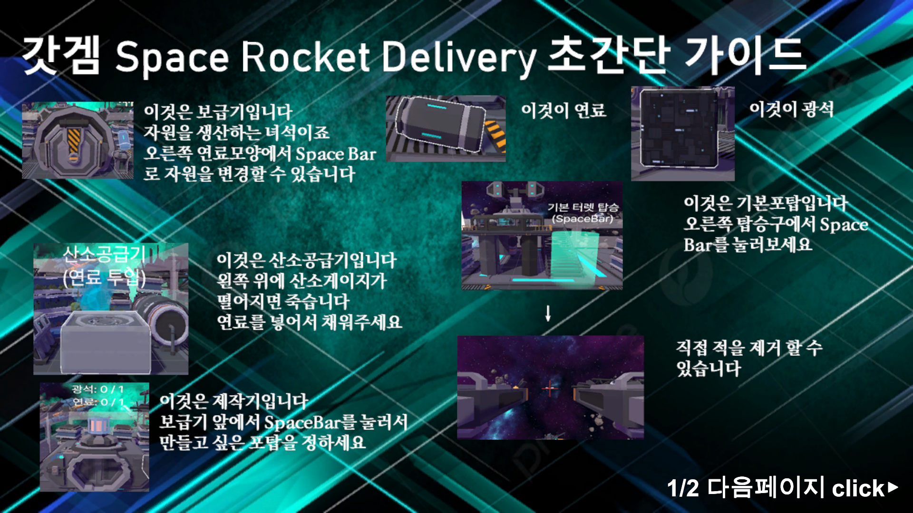
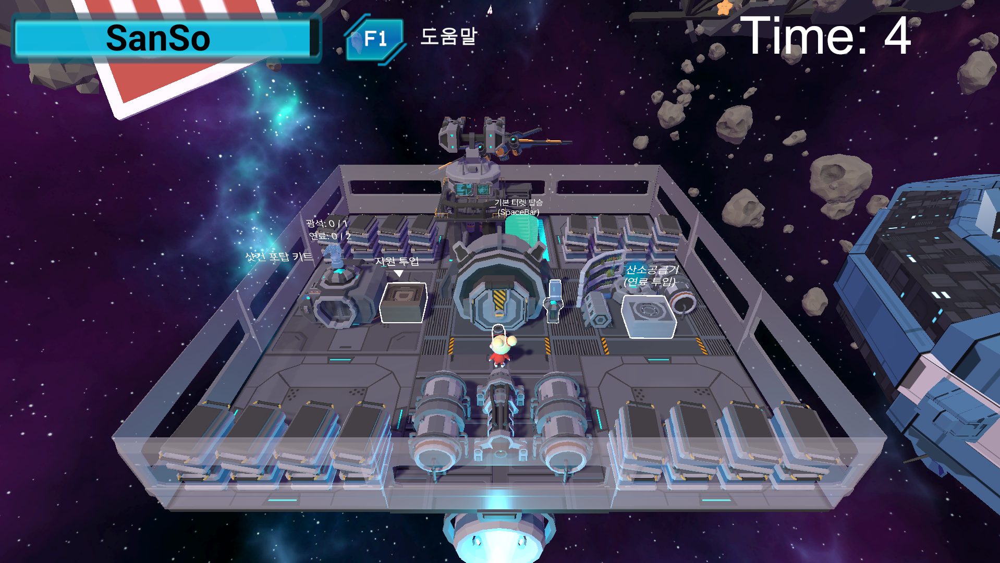
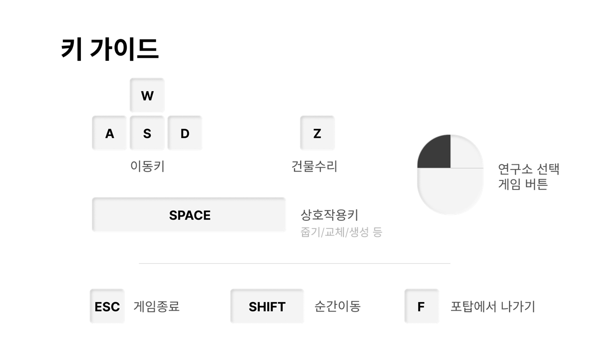
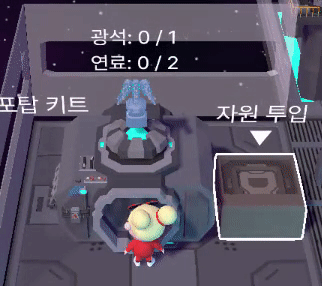
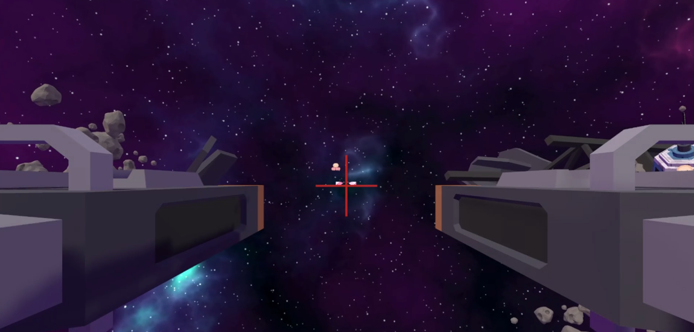
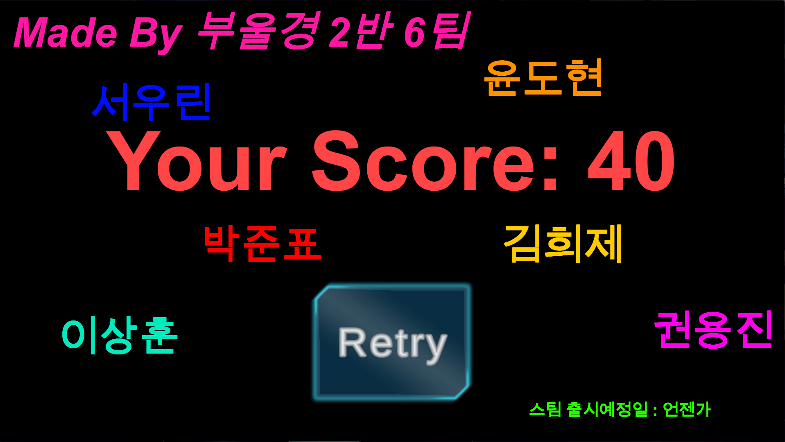
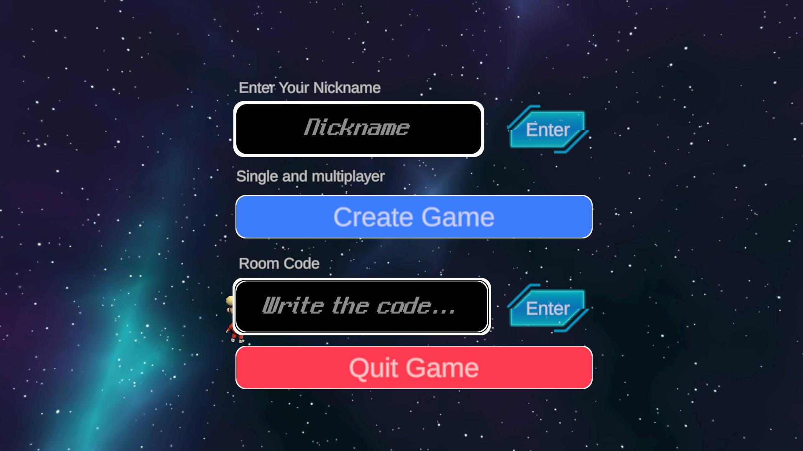
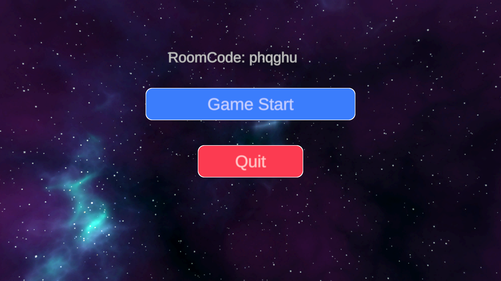

## 싱글플레이 시나리오

1. 진입 시 메인화면
 

 

2. 튜토리얼을 선택하면 게임을 하는 방법에 대한 설명이 나옴
 

 

3. Enter를 누르면 나오는 게임 화면
 

 

4. 키설정은 다음과 같이 되어있다.
 

 

5. 자원이 생산되는 보급기에서 생산되는 자원 변경 가능
 

 

6. 제작소에서 제작하고 싶은 모듈로 Space를 눌러 변경이 가능함
 

 

7. 제작소에서 만들어진 키트를 들고 벽면에 다가가가면 포탑 생성이 가능
 

 

8. 기본 포탑에 탑승시 1인칭으로 공격이 가능
 

 

9. 위의 기능들을 이용하여 계속해서 다가오는 적을 막아야한다.
 

10. 못막을 경우 게임오버가 된다. Retry시 다시 시작할 수 있다.
 

 

## 멀티플레이 시나리오

1. 멀티플레이 시작시 닉네임과 방생성, 방코드에 관한 버튼이 뜬다.
먼저 닉네임을 입력한 후 Enter 버튼을 눌러야만 다른 버튼들이 작동한다. 방을 만들고 싶으면 Create Room을 해야하고, 만들어져 있는 방에 참가하기 위해서는 방코드를 입력한 후 Enter를 누르면 된다.
 

 

2. 방에 진입하면 게임을 시작하는 버튼과 방을 나가는 버튼 두가지가 있다.
 

 

3. 멀티플레이는 최대 4명까지 가능하다.
 

 

4. 현재 멀티플레이는 추가 기능 개발을 용이하게 하기 위해 팀원의 개인 서버를 이용하여 진행되고 있다.